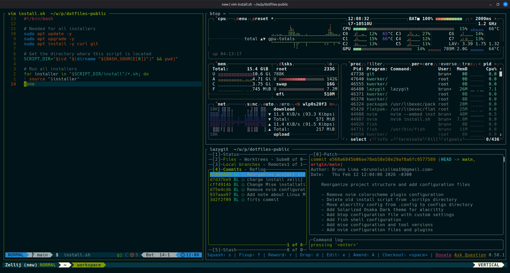

# Dotfiles

**Warning**: Don't blindly use my settings unless you know what that entails. Use at your own risk!

> **Note**: These configurations are based on Linux Mint or any other Debian-based distribution.

## Contents

- Neovim config
- Fish config
- Alacritty config
- Mise config

## Packages

- **Fish Shell** - with Fisher, Tide prompt, and Solarized Osaka theme
- **Neovim** - configured with LazyVim
- **Alacritty** - terminal emulator
- **Mise** - version manager for Go, Java, Node, and Neovim
- **Lazygit** - Git TUI
- **eza** - modern `ls` replacement
- **btop** - system monitor
- **Zellij** - terminal multiplexer
- **Docker** - containerization platform
- **Flatpak** - universal package manager for Linux
- **Windsurf** - AI-powered code editor
- **OpenCode** - AI code assistant

## Font

**Hack Nerd Font** - size 12

## Neovim setup

### Requirements

- Neovim >= **0.9.0**
- Git >= **2.19.0**
- [LazyVim](https://www.lazyvim.org/)
- [Hack Nerd Font](https://www.nerdfonts.com/) **_(needed to display icons)_**

## Shell setup (Fish)

- [Fish shell](https://fishshell.com/)
- [Fisher](https://github.com/jorgebucaran/fisher) - Plugin manager
- [Tide](https://github.com/IlanCosman/tide) - Shell theme
- [Mise](https://mise.jdx.dev/) - Dev tools version manager
- [Zellij](https://zellij.dev/) - Terminal multiplexer
- [eza](https://eza.rocks/) - Modern `ls` replacement
